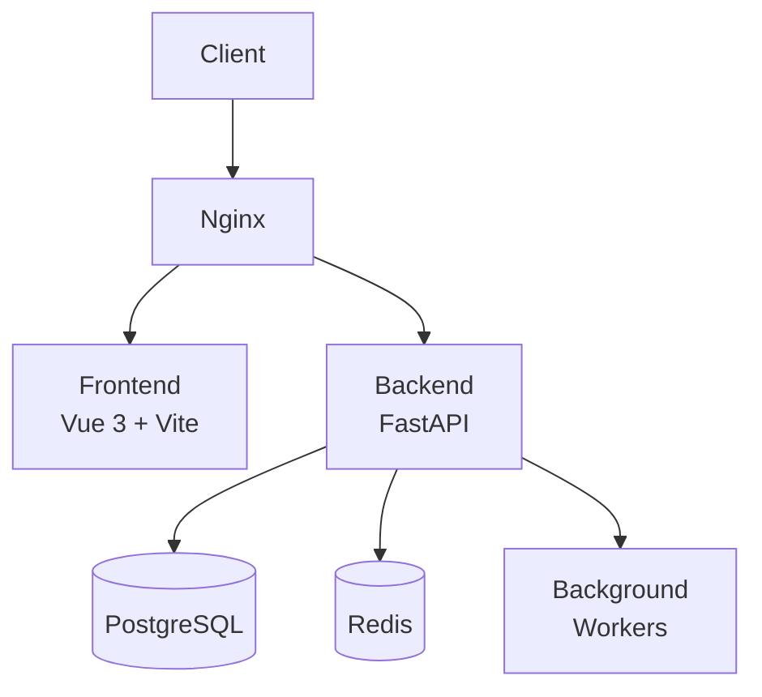

# Day 5 - Scalable Requirements Tracker

## Challenge Description
Backend microservice to track and version evolving system requirements. Goal: Manage changing specifications efficiently.

## Project Overview
This project implements a full-stack requirements tracking system with:
- Backend API built with FastAPI (Python)
- Frontend application built with Vue 3 + Vite
- PostgreSQL database for data persistence
- Redis for caching and session management
- Docker containerization for easy deployment
- Kubernetes configuration for orchestration

## Learning Goals
- Understand the core design trade-offs for a scalable requirements tracking system
- Implement a full-stack web application with modern technologies
- Practice microservices architecture patterns
- Learn containerization and orchestration concepts
- Apply security best practices

## System Architecture
The system follows a microservices architecture with separate frontend and backend services:



## Directory Structure
```
scalable-requirements-tracker/
├── backend/                      # FastAPI backend service
│   ├── app/
│   │   ├── api/                  # API routes (organized by domain)
│   │   ├── core/                 # Core settings and startup logic
│   │   ├── db/                   # Database and migrations
│   │   ├── models/               # SQLAlchemy ORM models
│   │   ├── schemas/              # Pydantic models for request/response
│   │   ├── services/             # Business logic / reusable service layer
│   │   ├── workers/              # Background workers (Celery or RQ)
│   │   ├── main.py               # FastAPI entrypoint
│   │   └── dependencies.py
│   ├── alembic/                  # Database migrations
│   ├── tests/                    # Pytest tests
│   ├── Dockerfile
│   ├── requirements.txt
│   └── README.md
├── frontend/                     # Vue 3 + Vite frontend app
│   ├── src/
│   │   ├── api/                  # Axios API clients
│   │   ├── components/           # Shared Vue components
│   │   ├── views/                # Page-level components
│   │   ├── router/               # Vue Router configuration
│   │   ├── store/                # Pinia store
│   │   ├── assets/               # Logos, CSS, icons
│   │   ├── styles/               # Tailwind CSS setup
│   │   ├── App.vue
│   │   └── main.js
│   ├── vite.config.js
│   ├── package.json
│   └── README.md
├── infra/                        # Deployment & Infrastructure
│   ├── docker-compose.yml
│   ├── k8s/                      # Kubernetes configuration
│   ├── env/                      # Environment configurations
│   └── README.md
├── docs/                         # Architecture & documentation
│   ├── architecture.md
│   ├── api_spec.yaml             # OpenAPI / Swagger
│   ├── design_decisions.md
│   └── nfrs.md
├── docker-compose.yml            # Root docker-compose for all services
├── nginx.conf                    # Nginx configuration
├── .env.example
├── .gitignore
└── LICENSE
```

## Quickstart - Development

### Prerequisites
- Docker and Docker Compose
- Node.js (v16+) for frontend development
- Python (3.8+) for backend development

### Using Docker Compose (Recommended)
1. Start all services:
   ```bash
   docker-compose up -d
   ```

2. Access the application:
   - Frontend: http://localhost:3000
   - Backend API: http://localhost:8000
   - Database: localhost:5432
   - Redis: localhost:6379

### Manual Setup

#### Backend
1. Navigate to the backend directory:
   ```bash
   cd backend
   ```

2. Create a virtual environment and activate it:
   ```bash
   python -m venv .venv
   source .venv/bin/activate  # or .venv\Scripts\activate on Windows
   ```

3. Install dependencies:
   ```bash
   pip install -r requirements.txt
   ```

4. Start the development server:
   ```bash
   uvicorn app.main:app --reload --port 8000
   ```

#### Frontend
1. Navigate to the frontend directory:
   ```bash
   cd frontend
   ```

2. Install dependencies:
   ```bash
   npm install
   ```

3. Start the development server:
   ```bash
   npm run dev
   ```

## API Documentation
- Swagger UI: http://localhost:8000/docs
- ReDoc: http://localhost:8000/redoc
- OpenAPI spec: [docs/api_spec.yaml](docs/api_spec.yaml)

## Testing

### Backend Tests
```bash
cd backend
python -m pytest tests/ -v
```

### Frontend Tests
```bash
cd frontend
npm run test
```

## Deployment

### Docker
Build and run with Docker:
```bash
docker-compose up -d
```

### Kubernetes
Deploy to Kubernetes cluster:
```bash
kubectl apply -f infra/k8s/
```

## Environment Variables
Copy [.env.example](.env.example) to create a `.env` file with your configuration:
```bash
cp .env.example .env
```

## Technology Stack

### Backend
- [FastAPI](https://fastapi.tiangolo.com/) - Modern, fast (high-performance) web framework
- [SQLAlchemy](https://www.sqlalchemy.org/) - SQL toolkit and Object Relational Mapper
- [Alembic](https://alembic.sqlalchemy.org/) - Database migration tool
- [Pydantic](https://pydantic-docs.helpmanual.io/) - Data validation and settings management
- [Redis](https://redis.io/) - In-memory data structure store
- [PostgreSQL](https://www.postgresql.org/) - Advanced open-source relational database

### Frontend
- [Vue 3](https://v3.vuejs.org/) - Progressive JavaScript framework
- [Vite](https://vitejs.dev/) - Next generation frontend tooling
- [Tailwind CSS](https://tailwindcss.com/) - Utility-first CSS framework
- [Pinia](https://pinia.vuejs.org/) - Intuitive store for Vue
- [Vue Router](https://router.vuejs.org/) - Official router for Vue.js

### Infrastructure
- [Docker](https://www.docker.com/) - Containerization platform
- [Kubernetes](https://kubernetes.io/) - Container orchestration system
- [Nginx](https://nginx.org/) - Web server and reverse proxy

## Documentation
- [Architecture](docs/architecture.md)
- [API Specification](docs/api_spec.yaml)
- [Design Decisions](docs/design_decisions.md)
- [Non-Functional Requirements](docs/nfrs.md)

## Next Steps
- Implement real-time collaboration features with WebSockets
- Add advanced search and filtering capabilities
- Implement audit logging for all changes
- Add export functionality (PDF, Excel, etc.)
- Implement advanced notification system
- Add integration with third-party tools (Jira, Trello, etc.)
- Implement advanced analytics and reporting
- Add support for custom fields and templates