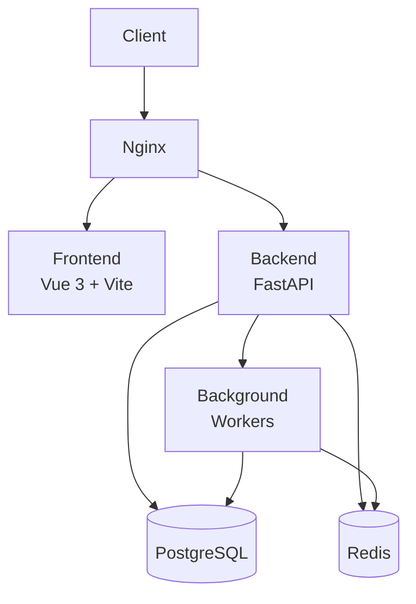

# Scalable Requirements Tracker - Architecture

## Overview

The Scalable Requirements Tracker is a distributed system designed to manage evolving system requirements with version control, collaboration features, and scalability in mind. The system follows a microservices architecture with separate backend and frontend services.

## System Components

### 1. Frontend (Vue 3 + Vite)
- Single-page application built with Vue 3
- Responsive UI with Tailwind CSS
- State management using Pinia
- Routing with Vue Router
- Communication with backend via REST API

### 2. Backend (FastAPI)
- RESTful API built with FastAPI (Python)
- Asynchronous request handling
- SQLAlchemy ORM for database operations
- Alembic for database migrations
- JWT-based authentication
- Redis for caching
- Background workers for async tasks

### 3. Database (PostgreSQL)
- Primary data store for requirements, projects, users
- ACID compliance for data integrity
- Support for complex queries and relationships
- Indexing for performance optimization

### 4. Cache (Redis)
- In-memory data structure store
- Caching of frequently accessed data
- Session storage
- Message broker for background tasks

### 5. Background Workers
- Asynchronous task processing
- Event-driven architecture
- Task queues for long-running operations

### 6. Reverse Proxy (Nginx)
- Load balancing
- SSL termination
- Static file serving
- Request routing

## Architecture Diagram

## Data Flow

1. **User Interaction**: Users interact with the Vue.js frontend through a web browser
2. **API Requests**: Frontend communicates with the FastAPI backend via REST API
3. **Authentication**: JWT tokens are used for secure authentication
4. **Data Processing**: Backend processes requests and interacts with PostgreSQL
5. **Caching**: Frequently accessed data is cached in Redis for performance
6. **Background Tasks**: Long-running operations are handled by background workers
7. **Data Persistence**: All data is persisted in PostgreSQL

## Scalability Considerations

### Horizontal Scaling
- Backend services can be scaled horizontally behind a load balancer
- Database read replicas can be used for scaling read operations
- Redis clusters for distributed caching

### Database Sharding
- Requirements can be sharded by project ID
- Version history can be partitioned by date

### Caching Strategy
- Multi-level caching (application-level and database-level)
- Cache invalidation policies
- Write-through and read-through caching patterns

### Load Balancing
- Round-robin load balancing for backend services
- Session affinity for WebSocket connections (if needed)
- Health checks for service discovery

## Security Considerations

### Authentication
- JWT-based token authentication
- Secure password hashing with bcrypt
- Role-based access control

### Data Protection
- SSL/TLS encryption for data in transit
- Database encryption for sensitive data at rest
- Input validation and sanitization

### Rate Limiting
- API rate limiting to prevent abuse
- DDoS protection at the load balancer level

## Failure Scenarios

### Database Failure
- Automatic failover to standby database
- Data replication for redundancy
- Backup and restore procedures

### Cache Failure
- Graceful degradation to database queries
- Cache warming strategies
- Monitoring and alerting for cache performance

### Service Degradation
- Circuit breaker patterns
- Retry mechanisms with exponential backoff
- Fallback responses for critical operations

## Monitoring and Observability

### Logging
- Structured logging with log levels
- Centralized log aggregation
- Log retention policies

### Metrics
- Application performance metrics
- Database query performance
- Cache hit/miss ratios
- API response times

### Tracing
- Distributed tracing for request flows
- Error tracking and reporting
- Performance bottleneck identification

## Technology Stack

### Frontend
- Vue 3 (Composition API)
- Vite (Build tool)
- Tailwind CSS (Styling)
- Pinia (State management)
- Vue Router (Navigation)

### Backend
- FastAPI (Python web framework)
- SQLAlchemy (ORM)
- Alembic (Database migrations)
- Uvicorn (ASGI server)
- Pydantic (Data validation)

### Infrastructure
- Docker (Containerization)
- Kubernetes (Orchestration)
- PostgreSQL (Relational database)
- Redis (In-memory cache)
- Nginx (Reverse proxy)

### Development Tools
- Pytest (Testing framework)
- Black (Code formatting)
- Flake8 (Code linting)
- MyPy (Type checking)